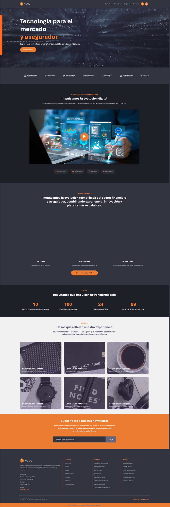

# Wan Website

Bootstrap Business website para WAN



## Caracteristicas

- Diseño moderno estilo fintech con estética oscura y detalles en color acento
- Layout responsive optimizado para desktop, tablet y mobile
- Sección de servicios con flip cards animadas en 3D
- Animaciones suaves de imágenes (crossfade y efecto escalonado)
- Carrusel automático de logos de clientes
- Sección “Nuestra Empresa” con transición visual dinámica
- Efectos visuales tipo hover, gradientes y microinteracciones
- Cards de proyectos con efecto tilt 3D interactivo
- Formulario de contacto con diseño moderno tipo SaaS
- Navegación con efecto sticky y transición al hacer scroll
- Uso de iconografía con Font Awesome

## Uso

Este website fue creado con [Bootstrap](https://getbootstrap.com/) y [Sass](https://sass-lang.com/). Utiliza [Font Awesome](https://fontawesome.com/) para los iconos.

Para customizar la website, necesitas instalar [Node.js](https://nodejs.org/en/). Despues clonar el repositorio y correrlo

```bash
npm install
```

Esto instalara Bootstrap, Sass and Font Awesome. Para crear to archivos CSS  de Sass, corre:

```bash
npm run sass:build
```

Para visualizar los cambios en los archivos Sass, corre:

```bash
npm run sass:watch
```

Para agregar variables de Bootstrap al archivo `bootstrap.scss`. Puedes ver el `node_modules/bootstrap/dist/scss/_variables.scss` para el listado de todas las variables. No editar directamente el archivo `variables.scss` , porque será sobrescrito cuando al actualizar Bootstrap.

Para agregar tus estilos cutomizados, modificar el archivo `styles.scss` .
